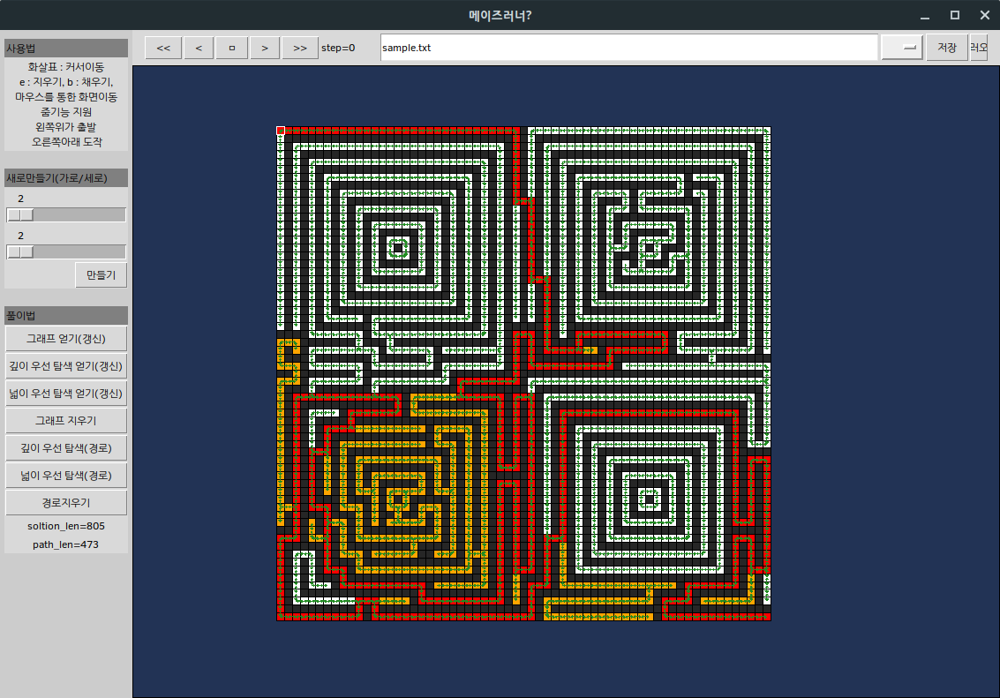

This is simple maze editor and solver. 
you can simulate the process of solving with BFS or DFS algorithms.
I am sorry for that it is a not english version. But it is not hard to understand how to do.
just do it.

